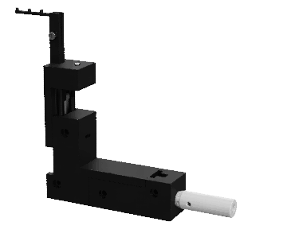

# DrosoMenu

A modular device to feed fruit flies under a microscope or any experimental setup. It can be controlled via I/O or via USB and serial communication, allowing integration with a variety of DAQs, Python, MATLAB and/or Bonsai.

  

